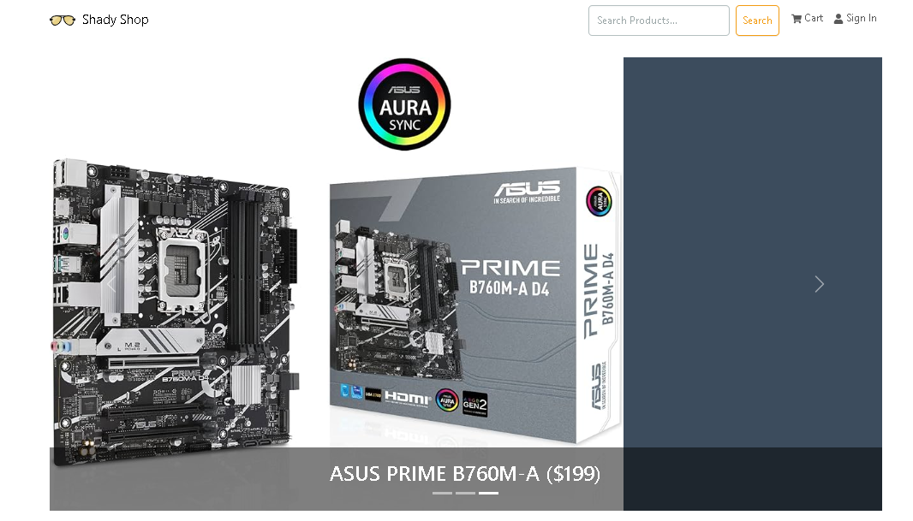

# Shady Shop (MERN) E-commerce App

## Technologies Used

- Shady UI
- ReactJS
- Redux
- Bootstrap
- Express
- Node.js
- MongoDB
- Postman

## Features

### Basic

- Search product
- Add to cart
- Delete from cart
- Edit order
- Checkout through PayPal
- Place an order
- Register
- Sign in

### Admin

- Edit user name & email
- Delete user
- Set user as admin
- Add product
- Remove product
- Mark as delivered
- Edit product

## Video Demonstration

## License

This project is licensed under the MIT License - see the [LICENSE.md](LICENSE.md) file for details.

© 2024 Dius Montenegro
